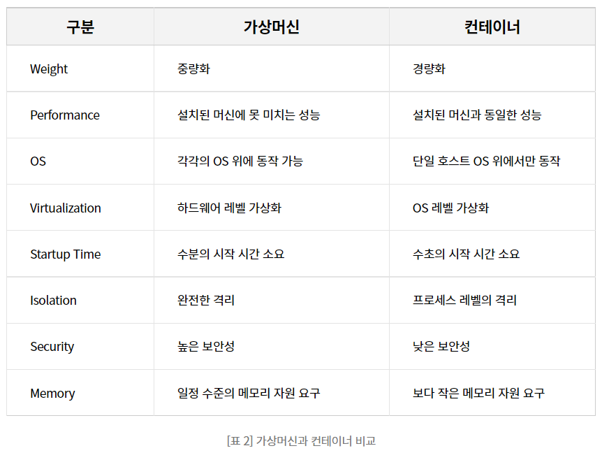

# Containerization vs Virtualization

헷갈리기 쉬운 컨테이너와 가상화 개념 정리

## 0. 목차

- [1. 컨테이너](#1-----)
  * [1.1. 리눅스 컨테이너](#11---------)
  * [1.2. Docker](#12-docker)
  * [1.3. LXC](#13-lxc)
- [2. 가상화](#2----)

## 1. 컨테이너

컨테이너란?

- 컨테이너 엔진을 통해 **가상의 격리된 공간**을 생성하는 기술
  - 호스트 OS의 자원을 공유하지만 **프로세스 간의 격리**를 통해서 가상 공간에 독립성을 부여
    - 별도의 IP 어드레스를 할당하여 프로세스 별로 액세스할 수 있음
    - 각 어플리케이션이 독립된 공간에서 독립된 역할을 수행할 수 있게 함

컨테이너의 활용

- 여러가지 **실행환경을 통채로 백업** 가능
  - 실무에 많이 사용됨
  - 복잡한 실행환경에서 작성된 프로그램은 Docker **환경설정+프로그램을 한번에 배포**
  - 프로그램 업데이트 -> Docker 이미지 작성 -> Jenkins로 배치잡 생성/실행

### 1.1. 리눅스 컨테이너

리눅스 컨테이너 기술이란?

- 리눅스에서 기본적으로 제공하는 컨테이너 기술
  - `chroot` 명령어를 이용하여 OS레벨에서 별도로 분리된 실행환경을 만들 수 있음
  - 해당 공간을 이용해 리눅스를 처음 설치했을 때와 같은 실행환경을 만들어 줌
  - 리눅스 설치 필요 : macOS나 Windows에서는 가상머신 필요함
- 네임 스페이스와 컨트롤그룹이라는 커널 기능을 사용하여 격리된 공간을 관리함

네임 스페이스

- 6가지 네임스페이스를 활용하여 **컨테이너 별 공간에 고유의 이름을 붙임**
- PID : Process ID
  - 각 프로세스에 할당된 고유한 ID
- NET : Network
  - 네트워크 디바이스, IP, 포트 번호, IP 테이블 등
- MNT : Mount
  - 컴퓨터 시스템에 접속되어 있는 디바이스 정보를 OS에 인식하게 함
- UID : User ID
  - 네임스페이스별로 user ID, group ID를 할당함
- UTS 
  - 네임스페이스별로 호스트명과 도메인 명을 독자적으로 가짐
- IPC : Inter Process Communication
  - 프로세스 간 통신 객체를 네임스페이스별로 할당
  - **다른 네임스페이스의 프로세스와 통신 불가**

컨트롤그룹

- 물리적인 **하드웨어의 리소스를 프로세스 그룹 단위로 제어**하는 커널 기능
  - 리소스 : CPU, 메모리, I/O, 네트워크, 디바이스 노드 등
  - 컨테이너의 재기동 없이 리소스를 할당할 수 있게 해줌

### 1.2. Docker

도커 이미지

도커 컨테이너

도커 레지스트리

도커 네트워크

### 1.3. LXC

## 2. 가상화

가상화란?

- **하이퍼바이저**를 이용하여 하나의 시스템에서 **여러 운영체제**를 사용할 수 있게 지원하는 기술
  - 하이퍼바이저는 물리적인 하드웨어 시스템을 논리적인 단위로 나누는 역할을 수행
  - 하드웨어의 자원은 분리되어 가상의 논리적 공간에 할당, 격리된 공간을 제공함
  - 이렇게 격리된 공간을 **가상머신**이라고 함

가상화의 원리

- 하드웨어 위의 하이퍼바이저가 **자신이 하드웨어인 것처럼**(에뮬레이트) 동작
  - OS가 추가로 필요하여 **성능 저하** 존재

가상머신의 종류

- 타입1: native or bare metal
  - 타입 1에서는 하이퍼바이저가 하드웨어에서 직접 구동
  - 하드웨어에 직접 액세스하기 때문에 **가장 성능이 좋음**
  - Xen, **KVM**(AWS 등에서 사용함)
- 타입2 : Hosted
  - 이미 설치되어 있는 운영체제(HOST OS) 위에 VMM이 설치됨
  - 타입 1 대비 느림: 어플리케이션이 운영체제-VMM-HOST OS를 거쳐야 함
  - **VMWare**(윈도우 환경에서 리눅스를 사용할 때 많이 이용), Parallels Desktop
- 전가상화
  - 하이퍼바이저가 가상머신과 하드웨어의 통역을 수행
  - VMM이 하드웨어인 것처럼 동작: **가상머신의 OS는 자신이 가상 머신인 줄 모름**
- 반가상화
  - 각 가상머신이 직접 하드웨어와 통신
  - 각 OS는 자신이 가상 머신임을 인지하고 명령에 하이퍼바이저 명령을 추가해 하드웨어와 통신
  - 이 때 VMM은 리소스 관리만 하게 됨: 전가상화 대비 빠름

컨테이너와의 비교

JVM

- 응용프로그램 레벨에서의 가상화: 엄밀하게 가상머신은 아님
- CPU에 의존적이지 않은 bytecode를 생성할 목적으로 만들어짐
  - 생성된 bytecode는 JVM에서 각 운영체제에 맞게 명령을 내림