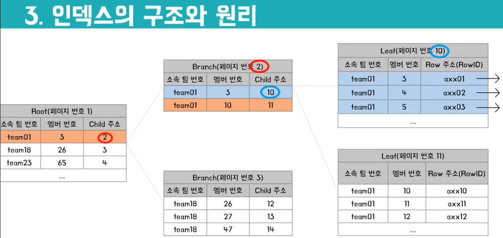

# Database

## 1. ORM

ORM이란?

- 객체와 데이터베이스의 데이터를 매핑해주는 것 : 객체 간의 관계를 바탕으로 **SQL을 자동으로 생성**
  - 객체 모델(클래스)과 관계 모델(테이블)간의 불일치를 해소해 줌
  - 프로그램에서 객체를 DB에 저장할 때 Object Persistence를 만드는데, 다음과 같은 방법을 활용함
    - JDBC를 이용해 직접 persistence layer를 구현
    - **Persistence framework**(SQL Mapper, ORM)을 사용
- SQL Mapper와의 차이
  - Mapper의 경우 **개발자가 직접 SQL을 작성**하여 데이터를 매핑시키도록 함
  - 세부적인 SQL 변경 시 편리하다는 장점이 있음
  - 대표적인 Mapper로 Mybatis가 있음
- ORM의 종류
  - Java : **JPA**, Hibernate
  - Node.js : Sequalize
  - Django : 내장 ORM
- 장점
  - 코드의 재사용성 및 가독성이 향상 : SQL문이 아니라 메서드를 이용하여 데이터를 조작할 수 있음
  - 객체 지향적인 접근으로 생산성을 올릴 수 있음
  - DB의 종류별 종속성을 줄이고 호환성을 높일 수 있음
- 단점
  - 구현이 어려움 : 설계가 복잡하고, 잘못 구현되면 일관성이 무너질 수 있음
  - **프로시저**가 많은 시스템에선 ORM의 객체 지향적인 장점을 활용하기 어려움
    - 특정 작업을 위한 프로그램의 일부로 함수와 같은 의미

## 2. Transactions

트랜잭션이란?

- 하나의 그룹으로 처리되어야 하는 여러 **쿼리들을 묶은 작업의 논리적 단위**
  - 트랜잭션은 DML 쿼리들의 조합으로 구성됨
  - 예) 송금 트랜잭션 : 돈 보내는 사람의 잔고 UPDATE + 받는 사람의 잔고 UPDATE
  - 쿼리들을 논리적으로 그룹화하기 위해 **커밋**과 **롤백**이 이루어 짐
- 트랜잭션은 한 **작업의 완전성**을 보장함
  - 트랜잭션 내의 모든 처리대상 명령문들이 반드시 완전히 수행되어야 함
  - 어느 한 문장이라도 에러가 발생한다면 트랜잭션으로 묶인 전체 명령문은 모두 취소

## 3. ACID

트랜잭션의 성질 ACID

- Atomicity
  - 트랜잭션 중간에 어떠한 문제가 발생한다면 트랜잭션에 해당하는 어떠한 작업 내용도 수행되어서는 안되며 아무런 문제가 발생되지 않았을 경우에만 모든 작업이 수행되어야 함
- Consistency
  - 트랜잭션은 발생 전후에 **데이터의 일관성**을 보장해야 함
  - 데이터의 일관성 : 한 데이터를 서로 다른 장소에서 참조했을 때 조회 결과가 일치하는 것
- Isolation
  - 각 트랜잭션은 서로 간섭 없이 실행되어야 함
  - isolation이 보장되지 않으면 트랜잭션이 원래 상태로 되돌아갈 수 없음
- Durability
  - 트랜잭션이 종료되면 영구적으로 DB에 작업의 결과가 저장되어야 함
  - 이를 위해 트랜잭션 종료시 커밋 또는 롤백을 수행함

## 4. N+1 Problem

N+1문제란?

- JPA에서 1:N 관계를 갖는 엔티티에 대해 하위 엔티티를 조회하려할 때 **N+1개의 쿼리가 발생**하는 문제
  - N의 크기가 커질 수록 DB에 엄청난 부하가 가해짐
- 발생 원인 : **ORM과 실제 RDBMS의 차이**
  - JPA에서 제공하는 `findAll()`메서드를 사용하면 JPQL이 쿼리를 N+1개 생성하는 것
- 다음 두 경우에 대해 발생함
  - EAGER 전략으로 데이터를 가져오는 경우
    - 상위 엔티티의 데이터를 조회하고(1) 글로벌 패치 전략을(EAGER)확인 후 하위 엔티티 데이터 로딩(N)
  - LAZY 전략으로 데이터를 가져온 이후에 가져온 데이터에서 하위 엔티티를 다시 조회하는 경우
    - LAZY 전략으로 `findAll()` 메서드를 실행하면 상위 엔티티만 가져옴
    - 이후 for문으로 하위 엔티티의 데이터를 조회하면 LAZY 로딩이 일어나면서 N+1문제 발생
- 해결 방법
  - Fetch JOIN 
    - 미리 조인을 해서 가져오기 때문에 쿼리는 1번만 수행됨
    - 1:N 관계가 2개인 엔티티를 패치 조인 사용 불가 : List를 Set으로 바꾸면 해결 가능
  - Batch size 조절
    - 설정한 size만큼 데이터를 미리 로딩함
    - 글로벌 패치 전략을 EAGER로 변경해야 함

## 5. Normalization

데이터베이스 이상(**anomaly**)이란?

- 잘못된 테이블 설계로 인해 **데이터의 중복이 발생하여 생길 수 있는 부작용**을 이상이라 함
  - 이상은 **정규화가 되어있지 않기 때문**에 발생함
  - 이상을 해결하기 위해서 속성들 간의 관련성을 파악해서 정규화를 해주어야 함
- 삽입 이상
  - 신규 데이터를 삽입하기 위해 불필요한 데이터를 함께 삽입해야 하는 경우
  - 예) 학번+과목명을 PK로 갖는 수강 과목 테이블에서 한 과목도 안 듣는 학생을 삽입할 때
    - PK는 null값을 가질 수 없기 때문에 "미수강" 항목을 추가로 만들어서 넣어줘야 함
- 갱신 이상
  - 중복되는 데이터 중 일부만 변경하여 데이터의 불일치가 발생하는 문제
  - 예) 3과목을 수강하는 학생의 과를 변경할 때 1개만 변경하면 해당 학생의 과가 무엇인지 모르게 됨
- 삭제 이상
  - 어떤 튜플을 삭제할 때 삭제가 되지 않아야 할 데이터도 같이 지워지는 문제
  - 예) 한 과목만 수강하는 어떤 학생이 수강 취소했을 때 해당 학생의 모든 정보가 지워짐

함수적 종속성(Functional Dependency)이란?

- 어떤 릴레이션 R의 속성 X, Y가 있을 때, 다음 상황에서 **Y는 X에 함수적 종속**이라고 함
  - X의 값을 알면 Y의 값을 식별할 수 있고
  - X의 값이 변화함에 따라 Y의 값이 달라짐
- 완전 함수적 종속성(Full Functional Dependency)
  - Y가 **속성 집합 X 전체에 대해서만 함수적 종속**이 되는 경우
  - 예) 위 예시에서 학점은 학번+과목명 전체에 대해서만 종속이고 둘 중 하나에 종속되진 않음
- 부분 함수적 종속성(Partial Functional Dependency)
  - Y가 **속성 집합 X의 일부에 대해서도 함수적 종속**이 되는 경우
  - 예) 위 예시에서 이름, 학과는 학번+과목명 전체에 대해서도, 학번에도 종속임

정규화와 반정규화

- 정규화 데이터베이스
  - 중복을 최소화하도록 설계된 테이블
  - 트랜잭션이나 CRUD가 많이 일어나는 경우에 사용(**OLTP**)
    - On-Line Transaction Processing : 비즈니스 거래 데이터로 실시간으로 CRUD가 일어남
  - 저장 공간 최소화, 안정성/무결성 유지, 이상 현상 제거라는 장점 있음
- 반정규화 데이터베이스
  - 개발이나 운영 상의 이슈로 인해 정규화된 **테이블을 역으로 합치는 경우**
    - 정규화된 테이블을 과다하게 JOIN하면 비용이 크기 때문에 의도적으로 정규화 원칙을 어김
  - 대량의 데이터를 읽고 처리하는 것이 중요한 경우에 사용(**OLAP**)
    - On-Line Analytical Processing : 분석과 집계를 위한 데이터로 변경이 적음
  - 빠른 조회가 가능하고 쿼리가 간단하여 버그 발생 가능성 낮다는 장점 있음

1NF

- 테이블은 **관계**여야 하며, 속성의 **원자성을 확보**하는 것을 제1정규형이라고 함
  - 각각 관계된 데이터 모임이 되도록 하기 위하여 분리된 테이블을 만들고 PK를 설정함
  - 도메인이 원자값이어야 함 : **중복되는 항목이 없어야 한다**
    - 여기에 NULL을 허용하지 않는 등 조건이 좀 추가될 수 있는데 이 정도만 알아두자
  - 예시에서 한 도메인에 여러 값이 들어가 있는데, 이를 다 나눠줘야 함 

2NF

- 후보 키 K와, K에 속하지 않는 속성 A가 있을 때, A를 결정하기 위해 K 전체를 참조해야만 하는 경우
  - 한 마디로 **1NF 테이블에서 부분 함수적 종속성을 제거**하면 2NF가 됨
    - **갱신이상을 해결**해 줌(모든 갱신이상을 해결하는 것은 아님)
  - 예) 기본키 학번+과목명에 대해 학과, 학비는 부분 함수적 종속성을 가짐(학번→학과, 학번→학비)
    - 학번, 과목명, 학점 테이블과 학번(PK), 학과, 학비 테이블 이렇게 2개로 분할하여 해결

3NF

- 2NF인 테이블에서 **모든 속성이 기본키에만 의존**하며, 다른 후보키에 의존하지 않는 경우
  - **이행적 함수 종속**(Transitive Functional Dependency)을 없애야 함
    - X→Y이고 Y→Z이면 X→Z이고, Z가 X에 이행적 함수 종속이라고 함
  - 예) 학번→학비는 사실 학번→학과, 학과→학비 이기 때문에 이행적 함수 종속임
    - 학번, 학과 테이블과 학과, 학비 테이블로 분할해주어야 함
- **3NF가 되면 정규화되었다**고 표현할 수 있음 : 삽입, 갱신 삭제 이상이 (거의)일어나지 않음

BCNF(Boyce-Codd Normal Form)

- 3NF인 테이블에서 **모든 종속성**에 대해서 다음을 만족하면 BCNF이다

  - X→Y는 trivial functional dependency이다 (Y는 X에 포함되는 속성이다)
    - 예) {Employee_ID, Employee_Name} –> Employee_ID
  - X는 슈퍼키이다
  - 다른 말로 하면 **모든 결정자가 슈퍼키**이면 됨

- 예) 테니스 코트 예약을 받는 상황에서 예약 타입→코트 종속성이 있음

  - 예약 타입 SAVER는 회원이 코트1을 예약, STANDARD는 비회원이 1을 예약, PREMIUM-A,B도 회원/비회원이 코트 2를 예약하는 경우
  - 타입에 의해 코트 번호를 결정할 수 있는 종속성이 있으나 코트 번호는 타입의 부분집합이 아니고, 예약 타입은 슈퍼키가 아님
    - 예약타입 + 시작 시각 or 종료 시각을 해 줘야 유일성 확보 가능
  - Rate type을 PK로 가지고 Court, Member flag 속성을 갖는 Rate types table과 {Court, Start time}을 PK로 가지고 Member flag, End Time 속성을 갖는 Today's bookings table으로 분할하여 BCNF 정규화

  

4NF

- BCNF에서 **다치 종속**(multivalued dependency)을 제거하면 4NF이다

  - 의미적으로 상관없는 속성을 한 테이블에 표현하면, 같은 값을 여러번 입력해야하는 다치 종속이 발생함
  - 한 테이블에 X→Y와 X→Z 종속성이 있지만 Y, Z는 아무런 연관이 없는 경우
  - 예) 피자집, 피자 메뉴, 배달 가능 지역 : 메뉴와 지역은 피자집에 종속되나 이 둘은 관계가 없음

  

5NF

- 4NF에서 **조인 종속**을 제거하면 5NF이다

  - 조인 종속 : 어떤 릴레이션의 속성의 부분집합끼리 JOIN했을 때 항상 자기 자신이 되는 경우

  - 조인 종속일 때는 **어떤 릴레이션의 모든 속성이 슈퍼키**임

  - 예) 개발자, 프로그래밍 언어, 자격증

    - 한 명의 개발자는 여러 언어를 가질 수 있고, 한 언어는 여러 개발자에 속할 수 있음
    - 한 자격증은 여러 개발자에 속할 수 있고, 한 개발자는 여러 자격증을 가질 수 있음
    - 한 언어는 여러 자격증에 속할 수 있고, 한 자격증은 여러 언어를 가질 수 있음

    

## 6. Index

인덱스란?

- 추가적인 쓰기 작업과 저장공간을 활용하여 DB테이블의 **검색 속도를 향상시키기 위한 자료구조**
  - 특정 column에 대해 데이터와(search key) 레코드의 주소를(pointer) 매핑해 따로 저장함
  - 내부적으로는 B-Tree, B+Tree 또는 해시테이블을 활용하여 만들어짐
    - 각각의 방식은 **Ordered Index, Hash Index**라고 함
  - 해시 테이블은 등호 연산에만 특화되어있기 때문에 B-Tree나 B+Tree가 사용되는 것이 일반적
    - DB는 부등호 연산이 보통 : range queries로 찾는 경우가 많기 때문에
- 인덱스의 필요성
  -  **Full Table Scan** : DB에서는 조회 요청이 들어올 때 테이블의 **모든 데이터를 검색**함
  -  데이터의 수가 늘어날 수록 검색이 느려지기 때문에 공간을 다소 희생해서 속도를 높이는 것
     - 인덱스는 데이터 외의 공간에 저장되고, 통상 10%정도를 추가로 필요로 함

Ordered Index의 종류

- Clustered(Primary Index)
  - 인덱스가 참조하는 레코드가 **순서대로 정렬**된 경우 : 범위 검색에 강점이 있음
    - 새로 저장하면 뒤에 있는 데이터를 하나씩 다 밀어줘야 함
  - 보통 PK를 Primary Index의 search key로 사용함
    - 테이블마다 단 하나만 존재할 수 있음
- Non-Clustered(Secondary Index)
  - 인덱스가 참조하는 레코드가 **순서와 상관없이 저장**됨 : 조회가 그렇게 효율적이진 않음
    - 레코드가 순서 상관 없이 있는거지 인덱스는 정렬되어 있음
    - cardinality가 낮은 경우에 사용하면 좋음!
  - Primary Index를 제외한 나머지를 다 Secondary라고 함 : 한 테이블에 여러개가 존재 가능
- Dense Index
  - 모든 레코드에 대해 인덱스 레코드를 가지는 인덱스
  - Secondary Index는 dense여야 함 : 레코드가 정렬되어있지 않기 때문
- Sparse Index
  - 테이블의 레코드 중 일부만 인덱스 파일에 반영된 경우 : Primary Index는 sparse여도 됨
  - dense index 대비 조회 속도를 약간 포기하고 삽입/갱신 오버헤드를 줄인 것
    - 삽입의 경우 **새로운 블록이 생성되었을 때만 삽입**해주면 됨
    - 삭제의 경우 해당 블록의 entry가 삭제되었을 때만 다음 search key로 바꿔주면 됨

인덱스의 구조와 원리

- 인덱스는 항상 정렬된 상태로 유지되어야 함
- 인덱스는 **Range scan**을 함
  - key column 순으로 정렬시켜두고 특정값을 찾다가 해당 범위를 넘는 값을 만나면 **멈춤**
  - 예) 5번 멤버를 찾기 위해 5번 이하의 멤버를 타고 리프까지 내려간 후 탐색하다 5번을 만나면 stop
  - 
  - Full table scan의 경우 원하는 값을 찾아도 뒤에 또 있을 수 있으니(정렬되지 않아서) 계속 찾음
- 위와 같은 Multilevel Index의 경우 **상위 레벨(Outer Index)은 메인 메모리에 저장**할 수 있음
  - 모든 인덱스가 메모리에 올라가면 좋지만 공간이 부족하면 하위 레벨은 디스크로 내려감
  - 내려가더라도 해당 범위만 scan하면 되기 때문에 조회 속도는 빠름

인덱스를 사용해야 하는 경우

- **Cardinality**가 높은 column에 인덱스를 적용한다
  - cardinality is the number of elements in the set
    - 여러 튜플들이 다 다른 값을 가질 때 cardinality가 높음
    - 성별이나 수강 과목 같은 경우 여러 튜플들이 동일한 값을 갖고 있으므로 cardinality 낮음
  - 같은 인덱스가 적용된 데이터가 많으면 그거 대상으로 다시 scan해야 해서 속도 향상이 적음
- SELECT문의 WHERE, JOIN이 자주 사용되는 경우
- INSERT, UPDATE, DELETE 등 데이터 수정이 적게 일어나는 경우
  - **원본 데이터의 수정이 있을 때마다 모든 인덱스의 수정이 필요**함
    - 블록 내의 주소에 변동이 있을 수 있기 때문
  - INSERT
    - 인덱스는 정렬된 상태로 존재하기 때문에 중간에 새 데이터가 들어온다면 하나씩 밀어줘야 함
    - 최악의 경우 Leaf Block이 꽉 차서 데이터를 다른 블록으로 옮겨야 하기도 함
  - DELETE 
    - 인덱스 테이블에서는 데이터를 삭제하지 않고 **사용하지 않음 표시**만 함
    - DELETE가 빈번하게 일어나면 금방 자리를 다 차지하고, 최악의 경우 원본보다 인덱스가 길어짐
  - UPDATE
    - 인덱스는 데이터를 변경하지 않음
    - DELETE로 사용 안 함 처리를 한 후 INSERT하기 때문에 부하가 큼