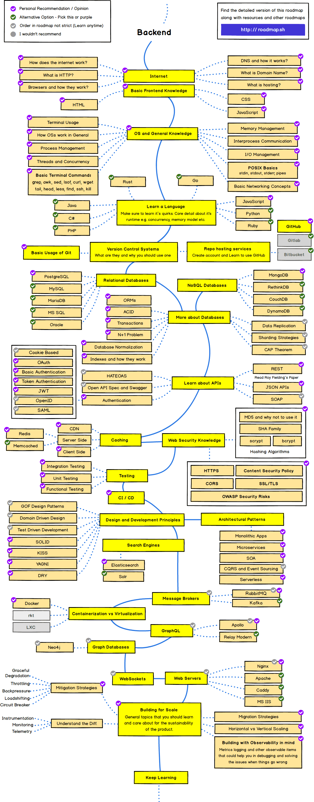

# Back-End 지식 공부

로드맵을 기준으로 Backend의 각 분야 기초 지식을 공부한 내용을 정리

Backend Developer Roadmap 2021

## 목차

[Internet](../General/Internet/README.md)
[HTML](../Frontend/HTML/README.md)
[CSS](../Frontend/CSS/README.md)
[JavaScript](../Frontend/JavaScript/README.md)
[OS](../General/OS/README.md)
[Java](./Java/README.md)
[Python](../General/Python/README.md)
[Git](../General/Git/README.md)
[RDBMS](./RDBMS/README.md)
[Database](./Database/README.md)
NoSQL
API
Caching
[Security](../General/Security/README.md)
[Testing](../General/Testing/README.md)
[CI-CD](../General/CI-CD/README.md)
Design And Development Principle
[Architecture Patterns](./Architecture Patterns/README.md)
Search Engines
Message Brockers
[Containerization vs Virtualization](./Containerization vs Virtualization)
GraphQL
GraphDB
GraphQL
WebSockets
Web Servers
Building for Scale