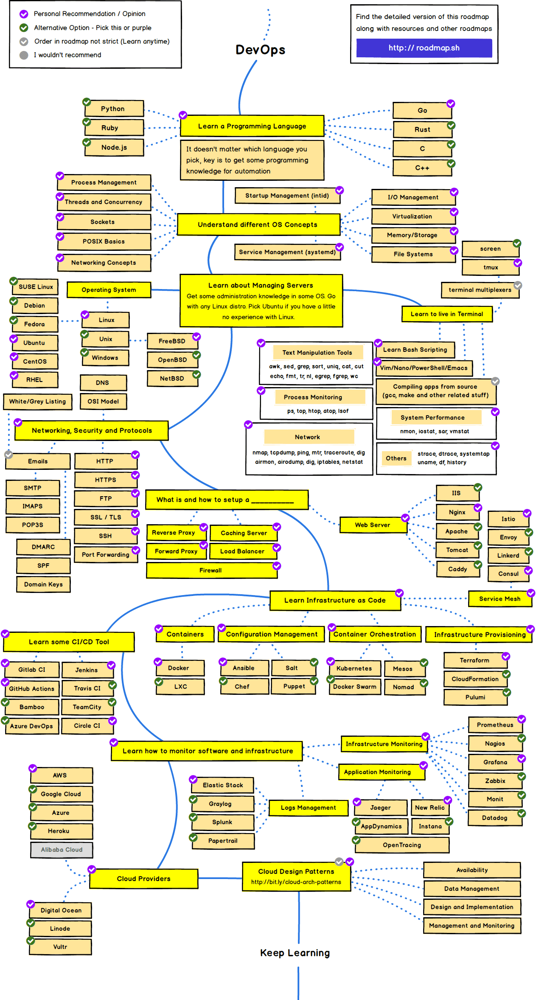

# DevOps 지식 공부

로드맵을 기준으로 DevOps의 각 분야 기초 지식을 공부한 내용을 정리

DevOps Developer Roadmap 2021

## 목차

- [Python](../General/Python/README.md)
- Node.js
- [OS](../General/OS/README.md)
- Managing Servers
- [Network](../General/Internet/README.md)
- Web Servers
- Infrastructure as Code
- [CI/CD](../General/CI CD/README.md)
- Container
- Monitoring
- [Cloud](../General/Cloud/README.md)

## 데브옵스란?

정의

- 애플리케이션과 서비스의 **개발에서 배포-운영까지 동시에** 할 수 있는 환경 또는 문화
  - 개발에서 운영까지를 하나의 파이프라인으로 형성하여 소스 코드의 배포가 필요할 때 즉시 반영함

장점

- 의사소통과 의사결정을 위한 노력과 비용의 절감
- 원하는 시점에 즉시 배포하고 운영할 수 있어 변화에 신속한 대응이 가능함

데브옵스에 필요한 환경

- 조직 구성
  - **서비스 생명주기가 한 팀으로** 같은 공간에서 결정되고 수행(기획, 설계, 개발, 배포 및 운영까지)
- 프로세스의 자동화와 시각화
  - Git, Jenkins, Dashboard, Issue Tracker 등의 도구들을 활용하여 상황을 공유하고 모니터링