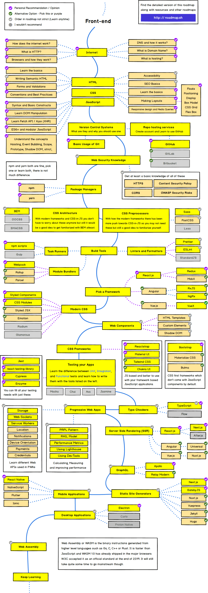

# Front-End 지식 공부

로드맵을 기준으로 Frontend의 각 분야 기초 지식을 공부한 내용을 정리

Frontend Developer Roadmap 2021

## 목차

[Internet](../General/Internet/README.md)
[HTML](./HTML/README.md)
[CSS](./CSS/README.md)
[JavaScript](./JavaScript/README.md)
[Git](../General/Git/README.md)
[Security](../General/Security/README.md)
Package Managers
CSS Architecture
CSS Processor
Build Tools
Framework
Modern CSS
Web Components
CSS Frameworks
Testing
Type Checkers
Progressive Web Apps
SSR
GraphQL
Static Site Generators
Mobile Apps
Desktop Apps
Web Assembly